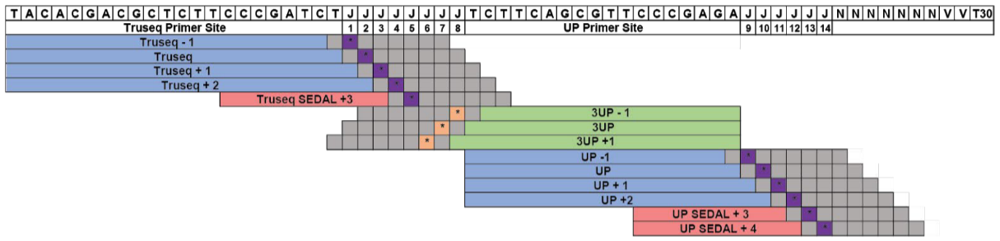

# PuckCaller

Base call on pucks for Slide-seq

## Input files

You should find data at the following location:

```
/camp/project/proj-slideseq/working/images
```

in a directory named as the date of the run.

In order to process the images, we capture the ligation and puck information from the file names with a regex.
So, the files need to be named in a certain for that to work.

For example, a file can be named the following way:

```
221012_ligation_1_MMStack_Pos0.ome.tif
```

The pattern recognized by the pipeline is the following:

```
<DATE>_ligation_<LIGATION>_MMStack_Pos<PUCK>.ome.tif
```

 * `DATE`: run's date
 * `LIGATION`: a number from 1 to 14 without gaps and in order
 * `PUCK`: puck number (`Pos` means position under the microscope and this accounts for the puck)

The files don't have to be in the same directory as Nextflow is recursively searching for this pattern.

## Parameters file

A typical parameter file should look like that:

```
date: "221012"
slices: 11
directory: renamed_data
order: order.csv
out_directory: pucks
```

It is a `YAML` file whose entries are the following:

 * `date`: run's date as in TIFF file names (`YYMMDD`)
 * `slices`: number of z positions in TIFF files
 * `directory`: path of directory containing TIFF files
 * `order`: path to ligation order file
 * `out_directory`: path of output directory for the pipeline

## Ligation order file

The `order.csv` file specifies the way `TIFF` files are organized.
It is used to trace back the base order from the ligation order.
Each ligation is peformed with a primer that corresponds to a base:



The order of the primers can vary so this needs to be recorded in the `order.csv` file.
The file needs to contain 4 columns:

 * `ligation`: ligation number contained in the `TIFF` file names
 * `primer`: primer used for the current ligation (needs to be among: `T+3`, `UP+3`, `UP+4`, `T-1`, `T`, `T+1`, `T+2`, `UP-1`, `UP`, `UP+1`, `UP+2`, `3UP-1`, `3UP`, `3UP+1`)
 * `base`: base number the current ligation sequences
 * `order`: same as base column

## Running the pipeline

Create a directory:

```
mkdir <DIRECTORY>
```

Get the code of the pipeline

```
git clone git@github.com:bahnk/PuckCaller.git <DIRECTORY>
```

If you're on NEMO, you need to change `runOptions = "-B /camp"` to `runOptions = "-B /nemo"` in the `nextflow.config` file.
Then, go to the directory:

```
cd <DIRECTORY>
```

Modify the ligation order file, for example:

```
ligation,primer,base,order
1,T+3,5,5
2,UP+3,13,13
3,UP+4,14,14
4,T-1,1,1
5,T,2,2
6,T+1,3,3
7,T+2,4,4
8,UP-1,9,9
9,UP,10,10
10,UP+1,11,11
11,UP+2,12,12
12,3UP-1,8,8
13,3UP,7,7
14,3UP+1,6,6
```

Modify the parameters file, for example:

```
date: "221012"
slices: 11
directory: renamed_data
order: order.csv
out_directory: pucks
```

Run the pipeline:

```
module load Nextflow/20.12.0-edge
module load Singularity/3.6.4
nextflow run main.nf -params-file params.yml -resume
```

